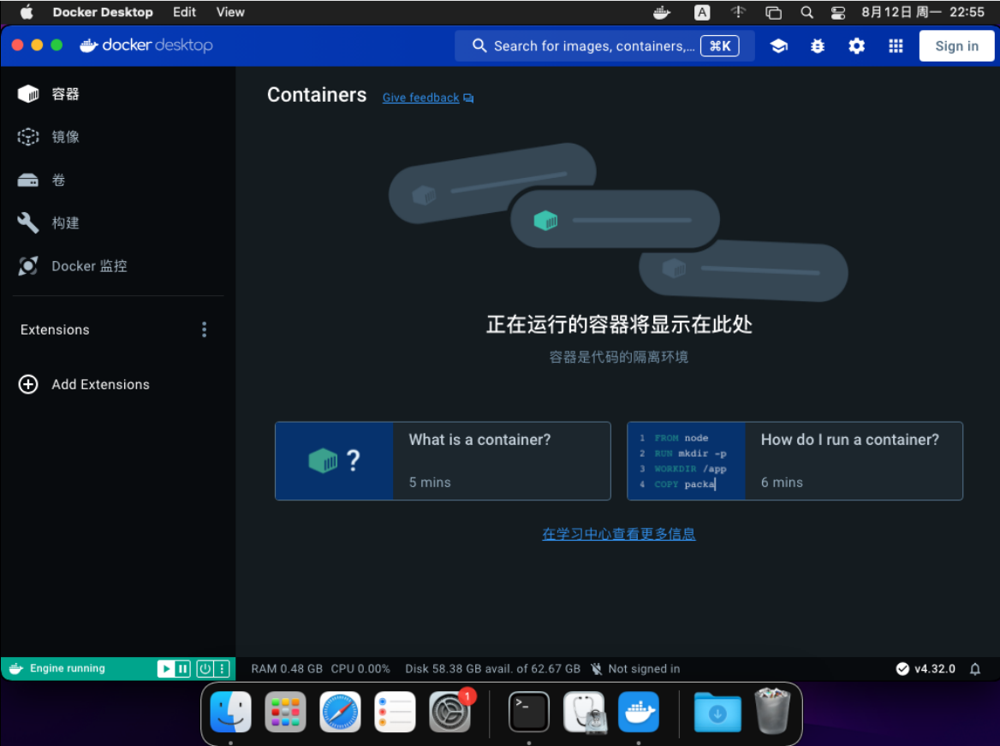

# DDCS-MAC

DDCS（Docker Desktop Chinese Script）的MAC版本。

<big>**你可以在这个仓库找到各个版本的汉化包：【 https://github.com/asxez/DockerDesktop-CN 】**</big>

## 使用方法
下载源码，启动终端并进入到源码根目录，使用以下命令即可：
```bash
sudo python3 ddcs.py
```

## 运行结果


## 更新历史
2024.8.13 发布MAC版本

2024.8.10 发布首个汉化脚本版本。

## Stars
如果你觉得本仓库对你有用，或者你对本仓库感兴趣，欢迎Star。
